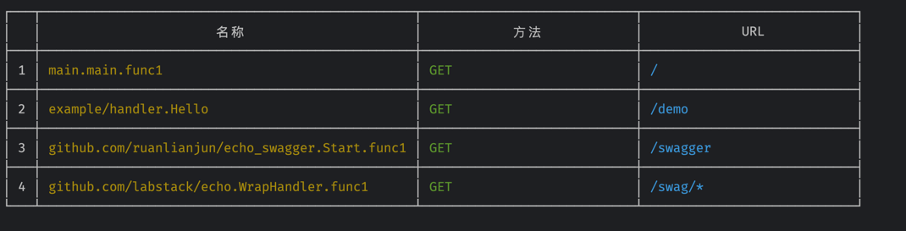
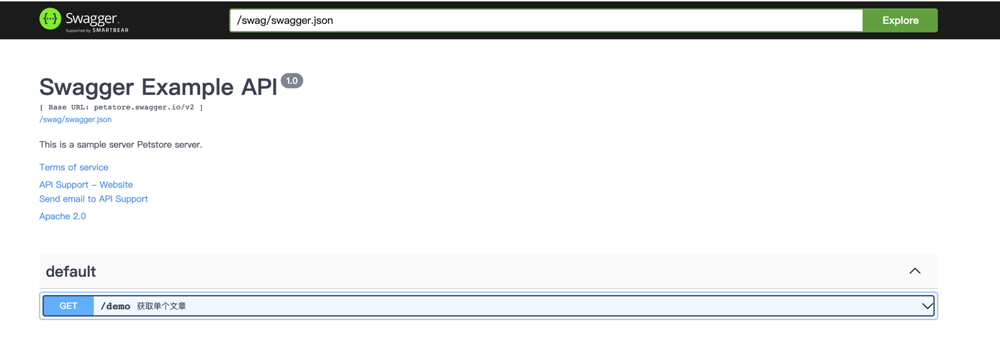

# golang echo的swagger


```go
  e := echo.New()
	e.Pre(echo_swagger.Swagger( //设置解析注释
		echo_swagger.WithSwaggerFilename("swagger/swagger.json"), //生产存储swagger.json的路径
        echo_swagger.WithMainFilename("swagger.go"), //解析的go入口函数，默认main.go
        echo_swagger.Refresh(true), //是否每次都重新生成swagger.json
	))
	
  e.GET("/", func(c echo.Context) error {
      return c.String(http.StatusOK, "Hello, World!")
    })
    e.GET("/demo", handler.Hello)

    e.HTTPErrorHandler = func(err error, context echo.Context) {
      fmt.Fprintf(os.Stdout, "URl:%s Method:%s Message:%s\n", context.Request().URL, context.Request().Method, err.Error())
    }
		
		// 启动swagger
    e.Logger.Fatal(echo_swagger.Start(e, ":1323", true))
```

### 浏览器打开

```shel
http://127.0.0.1:1323/swagger
```


### 路由




### 前端页面

